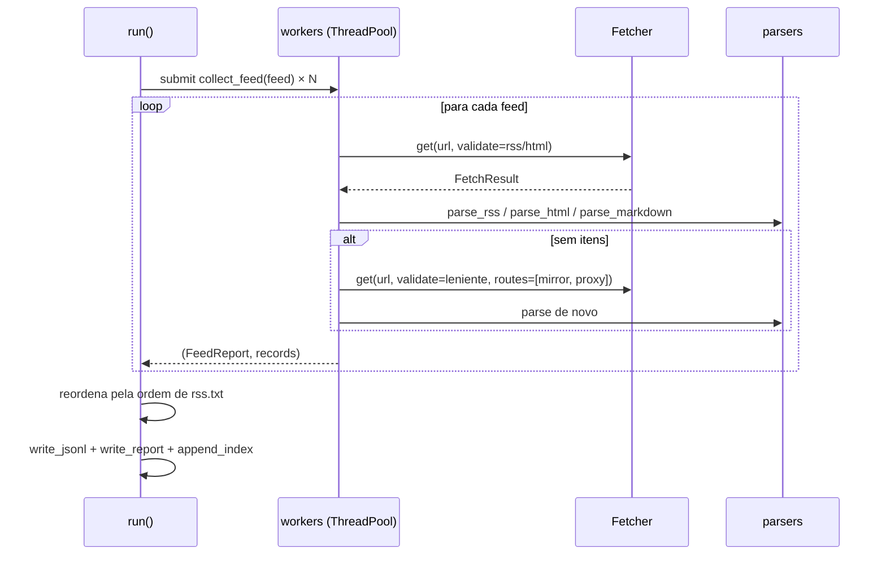

# `brnews/collector.py` — orquestração e escrita

Amarra [`feedlist`](feedlist), [`fetcher`](fetcher) e [`parsers`](parsers): baixa
todos os feeds em paralelo, monta os registros finais e grava as três saídas
(`news-*.jsonl`, `.report.json`, `index.jsonl`).

## Dataclasses de resultado

* **`FeedReport`** — diagnóstico de um feed na execução: `status`
  (`ok`/`empty`/`error`), nº de itens, rota e proxy/espelho usados, status HTTP,
  estratégia de parsing, tempo, tentativas e a lista `tried`.
* **`RunResult`** — a execução inteira: `run_id`, horários, caminhos dos arquivos,
  totais (ok/vazios/erro/itens/pulados), contadores de rota, stats de proxies e a
  lista de `FeedReport`s.

## `Collector.run(feeds, dry_run=False)`

* `run_id` tem o formato `20261005T000112Z-a1b2c3` (timestamp + 6 hex de UUID);
* os workers rodam num `ThreadPoolExecutor` (`--workers`, padrão 8);
* **nenhuma exceção de feed derruba a coleta**: um erro inesperado vira
  `FeedReport(status="error")` e a execução segue;
* a saída preserva a **ordem original de `rss.txt`**, independentemente da ordem de
  término das threads;
* com `dry_run=True` nada é escrito em disco.

## `collect_feed(feed, run_id, collected_at)` — um feed

1. **Download validado** — `fetcher.get(url, validate=...)` com `_validate_rss`
   (XML precisa ter itens e não ser HTML/página de bloqueio) ou `_validate_html`
   (> 800 bytes e não bloqueada), conforme o tipo do feed.
2. **Parsing com fallback cruzado** (`_parse`):
   * resposta de espelho em Markdown → `parse_markdown`;
   * feed `html` → `parse_html`; se vazio, tenta `parse_rss` (`rss-fallback`);
   * feed `rss` → `parse_rss`; se vazio, tenta `parse_html` (`html-fallback`) —
     cobre feeds que "viraram" página HTML.
3. **Segunda tentativa** — se ainda não há itens, refaz o download com a validação
   **leniente** (`_validate_lenient`: só exige > 300 bytes e não-bloqueado). Se a
   rota direta já tinha respondido, restringe a `["mirror", "proxy"]` (a resposta
   direta veio, mas sem notícias — a esperança é outra "visão" da página).
4. **Status final** — `ok` (tem registros), `empty` (baixou mas nada passou nos
   filtros; um eventual `bozo_reason` do feedparser vira o motivo) ou `error`.

## `_build_record` — o registro final

Monta o dict com [os ~27 campos do esquema](../dados/formato): `schema_version`,
identificação do feed (`feed_*`, de `Feed.as_dict()`), a notícia em si, e os
metadados `language` (padrão `pt-BR`), `source_domain` (host do link, sem `www.`),
`fetch_route`, `fetch_via` e `parser`.

Filtros aplicados aqui:

* `--max-age-days`: descarta item com `published` mais antigo que N dias
  (datas ausentes/inválidas **não** são descartadas);
* `--skip-seen`: descarta `id` presente em `seen_ids` (carregado por
  `load_seen_ids()` dos últimos N snapshots), contando em `skipped_seen`;
* `--no-content`: omite `content_text`;
* `--limit-per-feed`: corta a lista do feed após o dedupe.

## Escrita (append-only)

| Função | Saída |
| --- | --- |
| `snapshot_paths` | `data/<ano>/news-<AAAA-MM-DD>T<HHMMSS>Z.jsonl`; se o nome já existir, acrescenta `-2`, `-3`, … — **nunca sobrescreve**. |
| `write_jsonl` | Uma notícia por linha, `ensure_ascii=False`; com `--gzip`, `.jsonl.gz`. |
| `write_report` | `.report.json` com totais, rotas, stats de proxies e um `FeedReport` por feed. |
| `append_index` | Acrescenta **uma linha** a `data/index.jsonl` com o resumo da execução. |
| `load_seen_ids` | Lê os `id`s dos últimos N snapshots (`.jsonl` e `.jsonl.gz`) para o `--skip-seen`. |

## Integração com o GitHub Actions

| Função | Para onde escreve |
| --- | --- |
| `markdown_summary` | Resumo em Markdown (totais, top feeds, feeds com problema). |
| `write_step_summary` | Anexa o resumo ao `$GITHUB_STEP_SUMMARY`. |
| `write_github_output` | `run_id`, `items`, `feeds_ok`, `feeds_failed`, `jsonl`, `report` no `$GITHUB_OUTPUT` (consumidos pelo job `publicar`). |
| `write_annotations` | `::notice` com o total e até 12 `::warning` (um por feed sem notícias, com motivo e tentativas). |
