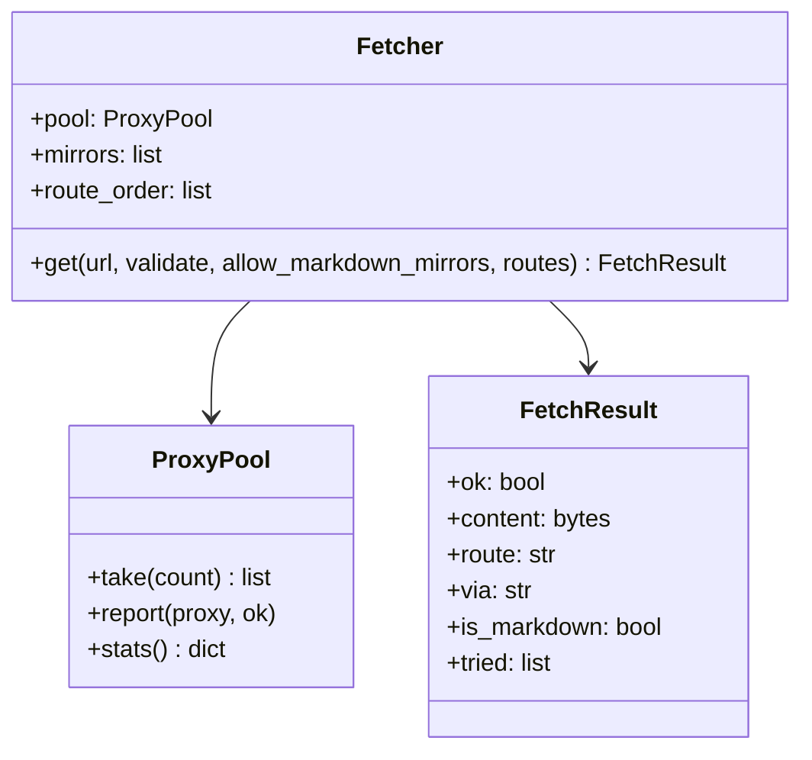

# `brnews/fetcher.py` — download HTTP com failover

Cliente HTTP que tenta várias "rotas" até conseguir um conteúdo **válido**. Existe
porque muitos portais brasileiros bloqueiam (403/429/Cloudflare) os IPs de datacenter
dos runners do GitHub Actions. Visão de usuário em
[Proxies e rotas](../guia/proxies); aqui, a visão de código.

## Peças principais



### `load_proxies(explicit, files, env_vars, use_standard_env)`

Junta proxies de CLI, arquivos (`config/proxies.txt`), variáveis
`BRNEWS_PROXIES`/`PROXY_LIST`/`PROXIES` e do ambiente padrão
(`HTTPS_PROXY`, …), normaliza cada entrada com `normalize_proxy()`
(esquemas aceitos: `http`, `https`, `socks4`, `socks5`, `socks5h`; `host:porta`
ganha `http://`) e deduplica preservando a ordem.

### `mask(url)`

Substitui `user:senha@` por `***@` — é aplicada **sempre** antes de registrar um
proxy em log, relatório ou JSONL.

### `ProxyPool`

Rodízio thread-safe com punição temporária:

* `take(n)` devolve até `n` proxies ativos, em round-robin a partir de um ponto
  aleatório por execução;
* `report(proxy, ok)`: sucesso zera o contador; a **3ª falha** põe o proxy em
  cooldown de **15 minutos** (`max_failures=3`, `cooldown=900`);
* só falhas de **transporte** (`ProxyError`, `ConnectionError`, `ConnectTimeout` —
  a tupla `TRANSPORT_ERRORS`) punem o proxy; `HTTP 403` do destino não.

### `Fetcher.get(url, validate=None, allow_markdown_mirrors=False, routes=None)`

O coração do módulo. Para cada rota de `route_order` (ou do parâmetro `routes`, que
permite ao chamador restringir — ex.: só `["mirror", "proxy"]` numa segunda
tentativa):

1. monta os alvos da rota — `direct` (1 alvo), `proxy` (até
   `max_proxies_per_url` proxies do pool), `mirror` (todos os espelhos compatíveis);
2. tenta cada alvo até `attempts_per_route` vezes (**espelhos: 1 vez só**), com
   backoff `backoff * tentativa + jitter`;
3. uma resposta só é aceita se: status < 400, corpo não vazio **e** o callback
   `validate(content, text)` aprovar;
4. ao aceitar, preenche `FetchResult` com `route` (`direct`/`proxy`/`mirror`),
   `via` (proxy ou nome do espelho, mascarado), `is_markdown` (espelho não-`raw`),
   tempo e tentativas — e esses valores chegam até os campos `fetch_route`/`fetch_via`
   do JSONL;
5. se tudo falhar, devolve `ok=False` com o último erro e a lista `tried`
   (usada nos relatórios e anotações do CI).

## Espelhos (`DEFAULT_MIRRORS`)

```python
{"name": "allorigins", "template": "https://api.allorigins.win/raw?url={qurl}", "raw": True}
{"name": "codetabs",   "template": "https://api.codetabs.com/v1/proxy/?quest={qurl}", "raw": True}
{"name": "cors-lol",   "template": "https://api.cors.lol/?url={qurl}", "raw": True}
{"name": "jina",       "template": "https://r.jina.ai/{url}", "raw": False}
```

* `{url}` é a URL crua; `{qurl}`, percent-encoded;
* `raw: False` (r.jina.ai) devolve **Markdown**, não o corpo original — esse espelho
  só entra quando o chamador passa `allow_markdown_mirrors=True`, e o resultado é
  marcado com `is_markdown=True` para ser parseado por `parse_markdown`;
* com `mirrors_through_proxy=True` (modo `--proxies-only`), a requisição ao espelho
  também sai por proxy; sem proxy disponível, a rota é pulada (nunca vaza o IP local).

## Anti-bloqueio nos headers e no ritmo

* **User-Agent rotativo** (`DEFAULT_USER_AGENTS`): navegadores (Chrome/Safari)
  intercalados de propósito com leitores de RSS (Feedly, Inoreader, Tiny Tiny RSS) —
  se um navegador leva 403, a tentativa seguinte vai como leitor de RSS;
* `Accept` priorizando `application/rss+xml`, `Accept-Language: pt-BR`, `Referer`
  apontando para a raiz do próprio host;
* **`_respect_host_delay`**: intervalo mínimo por host (`min_interval_per_host`,
  padrão 1s) compartilhado entre todas as threads;
* `session.trust_env = False`: os proxies do ambiente **não** são aplicados
  implicitamente pelo `requests` — só os controlados pelo pool;
* uma `requests.Session` por thread (`threading.local`) para reaproveitar conexões
  sem compartilhar estado.

## Contadores

`Fetcher.route_counters` acumula quantos downloads cada rota resolveu
(`direct`, `proxy`, `mirror`, `failed`). O valor aparece no `.report.json`
(`"routes"`), no resumo do job e em `data/index.jsonl`.
