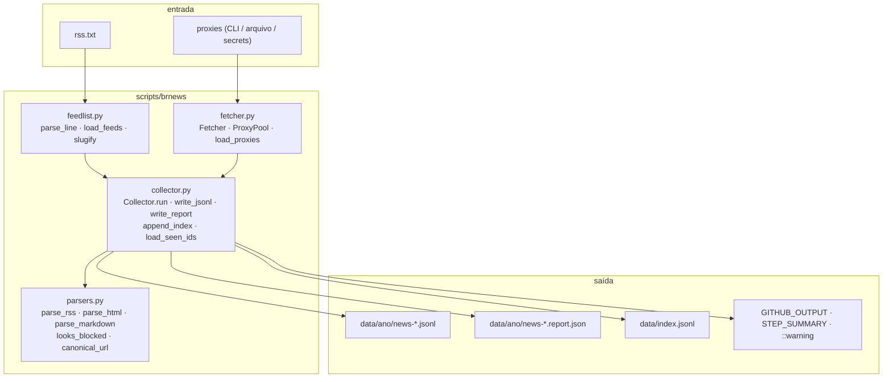

# Arquitetura — visão geral

O coletor é um pacote Python pequeno (`scripts/brnews/`, ~1.600 linhas) com quatro
módulos de responsabilidade única, amarrados por uma CLI
([`scripts/collect_news.py`](../guia/cli)).

## Ciclo de vida de uma execução

1. **Carregar feeds** — `feedlist.load_feeds("rss.txt")` devolve a lista de `Feed`s,
   já sem duplicatas e com slug/grupo/seção derivados do nome.
2. **Montar o `Fetcher`** — com os proxies de `load_proxies()`, a ordem de rotas e os
   limites de tempo/tentativas da CLI.
3. **Coletar em paralelo** — `Collector.run()` despacha um *worker* por feed num
   `ThreadPoolExecutor` (padrão: 8 threads).
4. **Por feed** — baixar com failover de rotas, validar ("tem notícia? não é página
   de bloqueio?"), parsear (RSS, HTML ou Markdown), normalizar cada item, deduplicar
   por `id` e aplicar filtros (`--limit-per-feed`, `--max-age-days`, `--skip-seen`).
5. **Gravar** — na ordem original de `rss.txt`: snapshot `news-<timestamp>Z.jsonl`
   (nunca sobrescreve), relatório `.report.json` e uma linha nova em
   `data/index.jsonl`.
6. **Reportar** — resumo Markdown no terminal e no `$GITHUB_STEP_SUMMARY`,
   outputs para os próximos jobs e anotações `::notice`/`::warning` no GitHub.

## Decisões de projeto

* **Append-only.** Snapshots nunca são sobrescritos (`snapshot_paths` acrescenta
  `-2`, `-3`… em caso de colisão de timestamp) e o workflow de publicação só
  **adiciona** arquivos. `data/index.jsonl` usa `merge=union` no `.gitattributes`
  para que pushes concorrentes se fundam sem conflito.
* **Um feed nunca derruba a coleta.** Cada worker captura qualquer exceção e a
  transforma em um `FeedReport` com `status="error"`; o restante segue.
* **Validação antes de aceitar.** Uma resposta HTTP 200 não basta: o conteúdo precisa
  conter notícias de verdade. Isso permite failover até quando o site devolve uma
  página de bloqueio "bem-sucedida".
* **Threads, não asyncio.** O gargalo é I/O de rede simples; `requests` + um pool de
  threads com sessão por thread (`threading.local`) mantém o código legível.
* **Segurança no CI.** O job que acessa a internet roda **sem token de escrita**
  (`persist-credentials: false`); só o job de publicação, que não acessa rede
  externa, recebe `contents: write`. Veja [Coleta semanal](../automacao/weekly-news).

## Páginas desta seção

| Página | Módulo | Conteúdo |
| --- | --- | --- |
| [feedlist](feedlist) | `scripts/brnews/feedlist.py` | formato de `rss.txt`, `Feed`, slugs |
| [fetcher](fetcher) | `scripts/brnews/fetcher.py` | rotas, `ProxyPool`, espelhos, anti-bloqueio |
| [parsers](parsers) | `scripts/brnews/parsers.py` | RSS/Atom, JSON-LD, cards, Markdown, limpeza |
| [collector](collector) | `scripts/brnews/collector.py` | orquestração, dedupe, escrita, relatórios |
