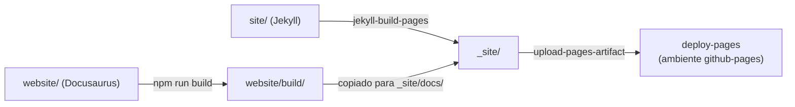

# `pages.yml` — publicação do site (Jekyll + Docusaurus)

O GitHub Pages do projeto combina **dois geradores**:

| Caminho | Gerador | Fonte |
| --- | --- | --- |
| `https://<usuario>.github.io/brnews-db/` | **Jekyll** | `site/` |
| `https://<usuario>.github.io/brnews-db/docs/` | **Docusaurus** | `website/` |

A página inicial (vitrine do projeto) é Jekyll; **toda a documentação** — este site —
é Docusaurus, montado sob `/docs`.



## Como funciona

1. **Jekyll** — o action oficial `actions/jekyll-build-pages` constrói `site/` em
   `_site/` (mesmo ambiente do GitHub Pages clássico; não é preciso Gemfile);
2. **Docusaurus** — `npm ci && npm run build` em `website/`; o `baseUrl` é
   `/brnews-db/docs/`, então os assets já saem com os caminhos certos;
3. o build do Docusaurus é copiado para `_site/docs/`;
4. `actions/upload-pages-artifact` + `actions/deploy-pages` publicam tudo no
   ambiente `github-pages` (método "GitHub Actions" nas configurações de Pages,
   sem branch `gh-pages`).

Dispara em push na `main` que toque em `site/**`, `website/**` ou no próprio
workflow — e também manualmente (`workflow_dispatch`).

## Ativação (uma vez só)

Em **Settings → Pages → Build and deployment**, selecione **GitHub Actions** como
source. Nenhuma outra configuração é necessária.

## Desenvolvimento local

### Documentação (Docusaurus)

```bash
cd website
npm install
npm run start        # dev server com hot reload em http://localhost:3000
npm run build        # build de produção em website/build/
```

### Página inicial (Jekyll)

```bash
cd site
gem install bundler jekyll
jekyll serve --baseurl /brnews-db   # http://localhost:4000/brnews-db/
```

:::note Por que dois geradores?
O Jekyll é nativo do GitHub Pages e perfeito para uma landing page leve; o
Docusaurus traz sidebar, busca, dark mode, Mermaid e versionamento para a
documentação técnica. Cada um faz o que faz de melhor — o workflow só costura os
dois no mesmo artefato.
:::
