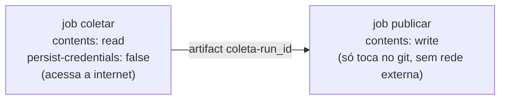

# `weekly-news.yml` — coleta semanal

O workflow principal. Roda toda **segunda-feira às 00:00 UTC** (`cron: 0 0 * * 1`,
domingo 21:00 em Brasília) e também sob demanda (`workflow_dispatch`).

:::note
Para o cron começar a rodar, o workflow precisa estar na branch **`main`** — o
GitHub só agenda workflows que existem na branch padrão.
:::

## Arquitetura de segurança: dois jobs

O job que baixa conteúdo de terceiros roda **sem token de escrita** no checkout.
Só o job `publicar` — que não acessa a rede externa — recebe `contents: write`.
Assim, nem um feed malicioso nem um espelho comprometido conseguem um token capaz
de escrever no repositório.

## Job `coletar`

1. checkout com `persist-credentials: false`;
2. Python 3.11 + `pip install -r requirements.txt` (com cache);
3. **testes offline** (`python -m unittest discover -s tests -q`) — a coleta nem
   começa se o coletor estiver quebrado;
4. `python scripts/collect_news.py --verbose --workers 8 --timeout 30 --attempts 3
   --min-interval 1 ...` com as entradas do workflow (validadas no shell antes:
   inteiros via regex, `route_order` contra uma whitelist);
5. empacota o snapshot + relatório + a última linha do índice e sobe como
   **artifact** (`coleta-<run_id>`, retenção de 90 dias);
6. o secret opcional `PROXY_LIST` vira a lista de proxies
   ([detalhes](../guia/proxies)).

## Job `publicar` (append-only)

1. baixa o artifact;
2. copia cada arquivo para `data/` **somente se ainda não existir** (um arquivo já
   presente gera `::warning` e é mantido como está);
3. acrescenta a linha nova ao `data/index.jsonl` (se ainda não estiver lá);
4. commita apenas `data/` e faz push com **até 5 tentativas**: em caso de corrida,
   faz fetch + rebase — e `data/index.jsonl` tem `merge=union` no `.gitattributes`,
   então linhas de execuções concorrentes se fundem sem conflito.

## Entradas do `workflow_dispatch`

| Entrada | Padrão | Vira (na CLI) |
| --- | --- | --- |
| `limit_per_feed` | `0` | `--limit-per-feed` |
| `max_age_days` | `0` | `--max-age-days` |
| `skip_seen` | `0` | `--skip-seen` |
| `route_order` | `direct,proxy,mirror` | `--route-order` (choice com 5 combinações) |
| `include_content` | `false` | omite `--no-content` quando `true` |
| `gzip` | `false` | `--gzip` |
| `dry_run` | `false` | `--dry-run` (não grava, não commita, não publica) |

## Observabilidade

* **Resumo do job** (`$GITHUB_STEP_SUMMARY`): total de notícias, feeds ok/vazios/com
  erro, rotas usadas, top feeds e a lista de feeds problemáticos;
* **Anotações**: um `::notice` com o total e até 12 `::warning` (feed sem notícias,
  motivo e rotas tentadas);
* **Artifact de 90 dias** com a coleta bruta, mesmo que o push falhe;
* `concurrency: weekly-news` impede duas coletas simultâneas.
