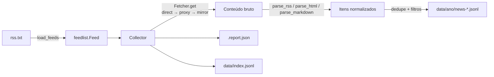

# brnews-db

**brnews-db** é um acervo de notícias em português coletadas automaticamente de feeds
RSS/Atom (e de algumas páginas HTML) de veículos brasileiros.

Toda **segunda-feira às 00:00 UTC** (domingo, 21:00 em Brasília) um workflow do GitHub
Actions percorre **todos** os feeds listados em [`rss.txt`](guia/rss-txt), normaliza o que
encontra e grava um arquivo **JSONL novo** em `data/`. Arquivos antigos nunca são
sobrescritos nem apagados — o acervo só cresce.

## Mapa do repositório

```text
brnews-db/
├── rss.txt                     # lista de feeds (Nome|URL [| HTML])
├── requirements.txt            # dependências Python do coletor
├── scripts/
│   ├── collect_news.py         # ponto de entrada (CLI)
│   └── brnews/                 # pacote do coletor
│       ├── feedlist.py         #   leitura/normalização de rss.txt
│       ├── fetcher.py          #   download com rotas direct/proxy/mirror
│       ├── parsers.py          #   RSS/Atom, HTML (JSON-LD, cards) e Markdown
│       └── collector.py        #   orquestração, dedupe e escrita dos JSONL
├── data/
│   ├── index.jsonl             # histórico append-only de execuções
│   └── <ano>/news-*.jsonl      # snapshots semanais (+ .report.json)
├── config/
│   └── proxies.example.txt     # modelo da lista de proxies (a real é ignorada pelo git)
├── tests/                      # testes offline (unittest + fixtures)
├── site/                       # página inicial do projeto (Jekyll)
├── website/                    # esta documentação (Docusaurus)
└── .github/workflows/
    ├── weekly-news.yml         # coleta semanal + publicação append-only
    ├── ci.yml                  # testes + coleta de amostra em cada push/PR
    └── pages.yml               # publica Jekyll (raiz) + Docusaurus (/docs)
```

## Componentes em uma frase

| Componente | O que faz |
| --- | --- |
| [`feedlist`](arquitetura/feedlist) | Lê `rss.txt` e transforma cada linha em um `Feed` com nome, slug, grupo, seção e tipo (`rss`/`html`). |
| [`fetcher`](arquitetura/fetcher) | Baixa cada URL tentando, em ordem, `direct` → `proxy` → `mirror`, com rodízio de proxies e validação de conteúdo. |
| [`parsers`](arquitetura/parsers) | Normaliza o conteúdo baixado (RSS/Atom via `feedparser`; HTML via JSON-LD, cards e links; Markdown de espelhos). |
| [`collector`](arquitetura/collector) | Orquestra o download em paralelo, deduplica, aplica filtros e grava `news-*.jsonl`, `.report.json` e `index.jsonl`. |
| [`collect_news.py`](guia/cli) | CLI que amarra tudo: argumentos, proxies, rotas e saídas para o GitHub Actions. |

## Fluxo resumido



## Por onde começar

- Quer **usar os dados**? Veja o [formato do JSONL](dados/formato) e as
  [receitas com `jq` e Python](dados/receitas).
- Quer **rodar o coletor** na sua máquina? Comece pela
  [instalação](guia/instalacao) e pela [referência da CLI](guia/cli).
- Quer **adicionar um feed**? É uma linha em `rss.txt` — veja
  [a lista de feeds](guia/rss-txt) e o [guia de contribuição](contribuindo).
- Quer **entender o código**? A seção [Arquitetura](arquitetura/visao-geral)
  percorre módulo por módulo.
